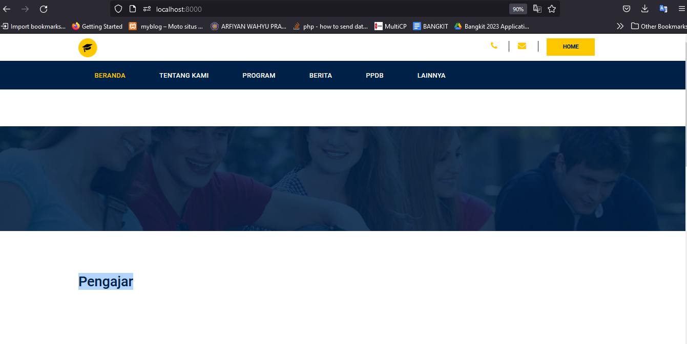
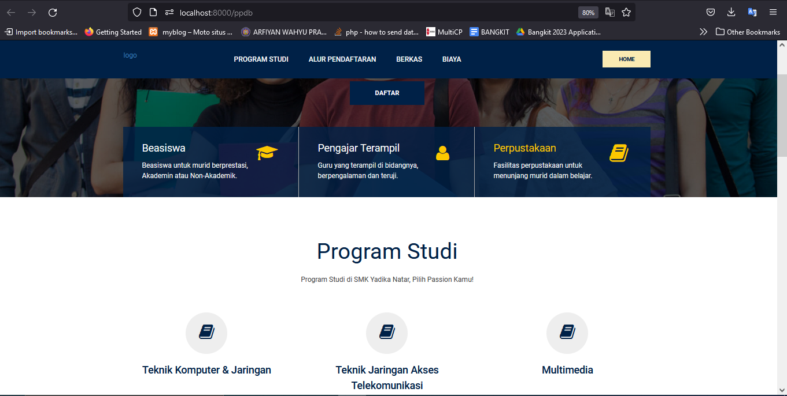
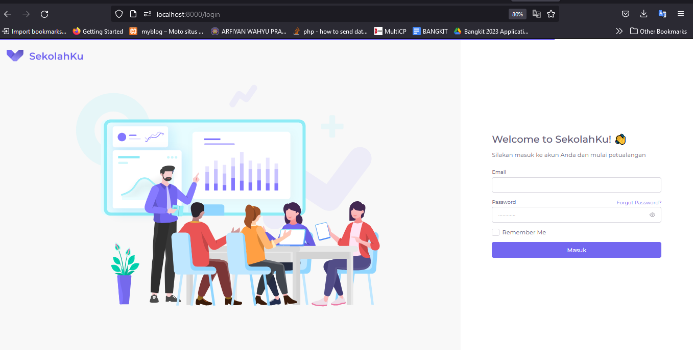
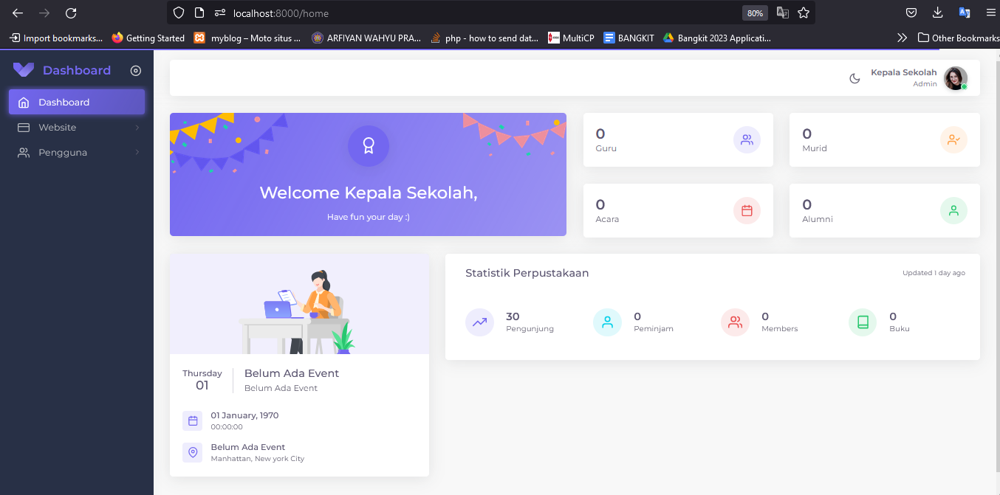
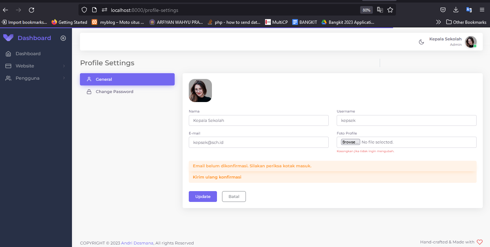
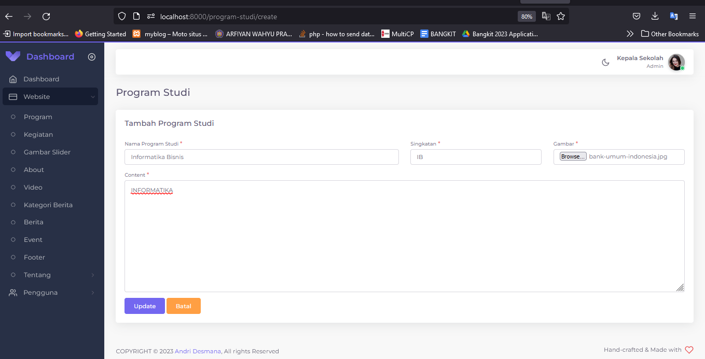
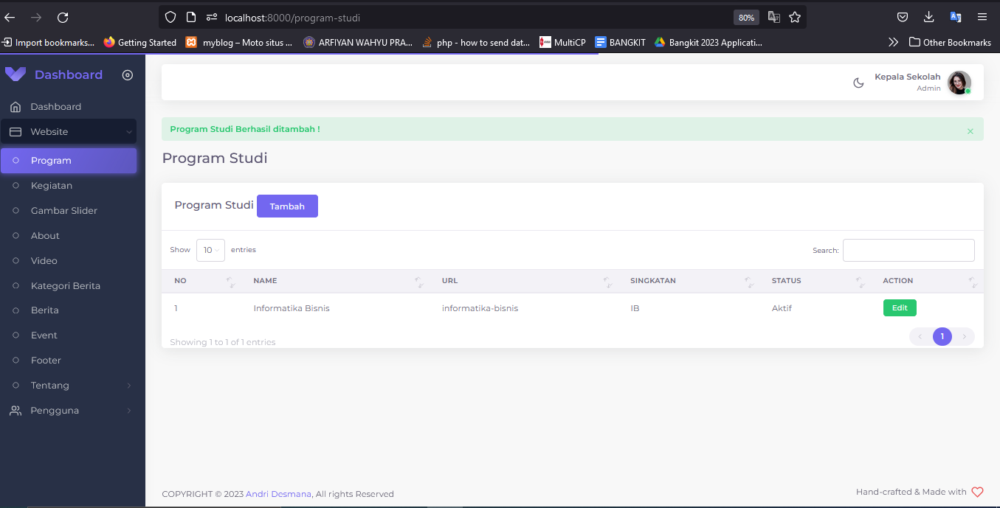
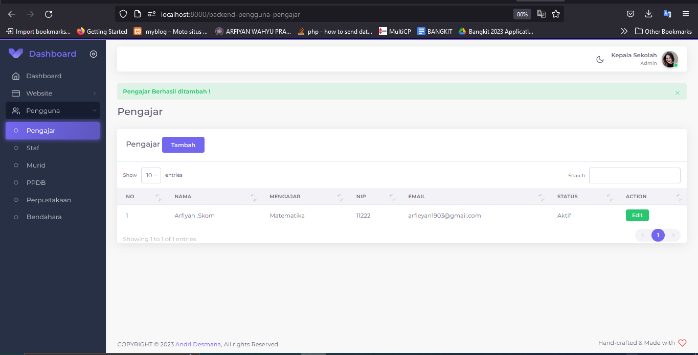

## Tentang Sekolahku

Sekolahku adalah aplikasi manajemen sekolah berbasis website yang di bangun dan di kembangkan dengan Framework Laravel. Fitur-fitur pada aplikasi Sekolahku antara lain :

-   Website Sekolah (Done)
-   PPDB (Done)
-   Perpustakaan (Done)
-   Sistem Pembayaran Sekolah SPP (Done)
-   Alumni

## Installation

-   Install [Composer](https://getcomposer.org/download) and [Npm](https://nodejs.org/en/download)
-   Clone the repository: `git clone https://github.com/andes2912/sekolahku`
-   Install dependencies: `composer install ; npm install ; npm run dev`
-   Run `cp .env.example .env` for create .env file
-   Run `php artisan migrate --seed` for migration database
-   Run `php artisan storage:link` for create folder storage

## Penggunaan

-   Login sebagai Admin email: kepsek@sch.id & pw: Bismillah
-   Login sebagai PPDB, Perpustakaan, Staf, Pengajar semua dengan password 12345678

## Tampilan

-   Halaman Home
    

-   Halaman PPDB
    

-   Halaman LOGIN
    

-   Halaman DASHBOARD
    

-   Halaman PROFILE
    

-   Halaman TAMBAH PROGRAM STUDI
    

-   Halaman LIST PROGRAM STUDI
    

-   Halaman TAMBAH PENGAJAR
    

-   Halaman LIST PENGAJAR
    

-   Halaman STAF PPDB
    
